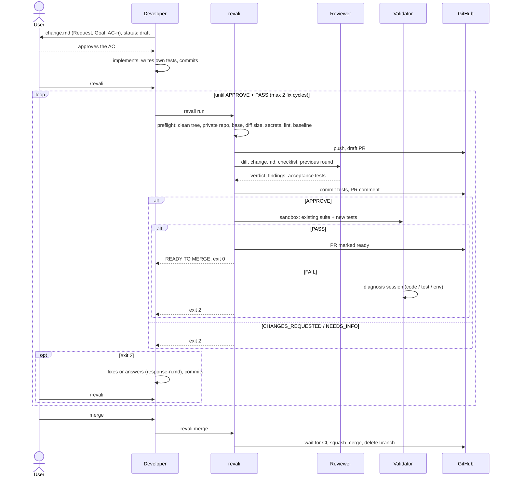

# revali

Review, validate, merge: a headless pipeline for feature branches on your own
GitHub repositories. Three roles take part.

- **Developer**: the authoring session (Claude Code, or you). Writes the
  acceptance criteria before the code, gets them approved, implements, and
  types `/revali`.
- **Reviewer**: an independent headless session revali spawns. Reviews the
  diff against the acceptance criteria and writes the acceptance tests. It
  does not run them.
- **Validator**: a sandbox run of the existing suite plus the Reviewer's
  tests. On failure only, a diagnosis session reads the output and says
  whether the code, the test, or the environment is at fault.



The preflight baseline (the existing suite in the sandbox) runs on every
`revali run` until the first review round is recorded, and not for
`kind: docs`. A sandbox `setup` or `build` failure is exit 1 (environment),
not a FAIL verdict.

| Role | Started by | Reads | Writes | Model |
|---|---|---|---|---|
| Developer | the user | the request, the repo | `change.md`, code, its own tests | whatever the user's session runs; recorded as `author_model` |
| Reviewer | revali, on `/revali` | diff, `change.md`, three-layer checklist, the previous round and `response-n.md` | tests in `test_dir`, and its answer, which revali turns into `review-n.md`, `tests.md`, and a PR comment; does not run the tests | `auto`: one tier above the Developer |
| Validator | revali, after APPROVE | a sandbox clone of the branch | logs; revali appends the result to `tests.md`; on FAIL only, the diagnosis session answers and revali writes `diagnose-n.json` | the runner needs none; diagnosis `auto`: one tier below the Developer |

Three user actions (approve the AC, `/revali`, `revali merge`) are the gates;
everything between them is automatic. Exit codes: `0` done / ready to merge,
`1` pipeline error (not a verdict), `2` the Developer must act (fix, rebase,
answer a question), `3` a human must decide, `4` (`wait` only) still running.

Status: v1.0 feature set complete (package version 0.1.0). Verified end to
end on a private GitHub repository with real Reviewer sessions and a real
WSL sandbox; revali reviews its own changes.

## Requirements

- Python 3.11+ (stdlib only), git, GitHub CLI (`gh auth login` done)
- Claude Code CLI on PATH (`claude`), for the reviewer / diagnoser sessions
- A place to run the sandbox: on Windows, WSL with an Ubuntu distro; on any
  host, a Linux machine reachable by key-based ssh (`runner = "ssh"`) with
  git, bash and coreutils installed

## Usage

```
python <path-to>/revali.py preflight        # checks only, changes nothing
python <path-to>/revali.py run              # detached; then:
python <path-to>/revali.py wait --timeout 9m
python <path-to>/revali.py merge            # only after READY TO MERGE; waits for CI
python <path-to>/revali.py status | stop | reset | clean <branch> | stats | version
```

What a run does, in order: preflight (including the existing suite in the
sandbox as a baseline), push + draft PR, reviewer round (`claude -p` with the
diff, change.md, and the checklist; writes tests into `test_dir`; the script
checks AC coverage, smoke-runs the new tests, commits them), validation
(existing suite + new tests in the sandbox; a diagnoser session only on
failure), then READY TO MERGE. Every result lands in `.revali/<branch>/`
(`review-<n>.md`, `tests.md`, `diagnose-<n>.json`, `logs/`) and as PR comments.

After exit code 2 the author fixes or answers in
`.revali/<branch>/response-<n>.md` (`- F1: fixed` / `- F1: wontfix: <reason>`),
commits, and runs again; each such cycle counts against `review.max_fixes`.

## Configuration

Three layers, the most specific wins, and every key may appear in any of
them:

1. `defaults.toml` in the revali checkout: every key with its default. Edit
   it only when a new model generation arrives (the model ladders live
   here, under `[engines.<name>]`).
2. `~/.revali/config.toml`: your machine, every project. `checklist`,
   `history_path`, and any `[section]` from the project file (a WSL distro
   name, a budget, a pinned model). `REVALI_HOME` moves the directory.
3. `revali.toml` in the project root: the commands to build and test, the
   platforms, anything project-specific. `templates/revali.toml` is a
   starting point; a key left out inherits from the layers above.

Unknown keys are errors in every layer. `[review] engine` and
`[validate] engine` name the CLI that runs the session (`claude`; the old
`prompt | hybrid` meaning moved to `strategy`). Keys that name a file
(`prompt`, `schema`, `checklist_builtin`) are relative to the project
root; empty means the file revali ships with. `[validate.platform]` in
any layer sets the defaults for every `[validate.<name>]` table.

Models: `model = "auto"` (the default) picks the Reviewer one tier above
the Developer's model (`author_model` in `change.md`) and the diagnosis
session one tier below, on the ladder of the configured engine
(`[engines.claude] tiers = ["haiku", "sonnet", "opus", "fable"]`); an
unknown or missing `author_model` means the top tier for the Reviewer and
one below the top for diagnosis. `fallback_model = "auto"` is the tiers
below the chosen one, strongest first. Any explicit model name passes
through unchanged. The chosen model and the reason are printed at spawn
time and recorded in the review and diagnosis headers.

## Files

| Document | Written by | Read by | Default location | Config key |
|---|---|---|---|---|
| `change.md` (request, goal, AC-n) | Developer | Reviewer, diagnosis session | `.revali/<branch>/` | `[paths] state_dir` |
| `response-n.md` | Developer | Reviewer, next round | same | same |
| `review-n.md` / `.json` | revali, from the Reviewer's answer | you, the PR | same | same |
| `tests.md` | revali, from the Reviewer's answer; validation results appended | you, diagnosis session | same | same |
| `diagnose-n.json` | revali, from the diagnosis session | you | same | same |
| logs, prompts, raw answers | revali | you | `.revali/<branch>/logs/` | `[paths] logs_dir` |
| acceptance tests | Reviewer | Validator; merged into `main` | `tests/test_review_<topic>.py` | `[project] test_dir`, `test_file_pattern` |
| checklist, built-in layer | revali | Reviewer | `checklists/default.md` in revali | `[review] checklist_builtin` |
| checklist, user layer | you | Reviewer | none | `checklist` in `~/.revali/config.toml` |
| checklist, project layer | the project | Developer (via `CLAUDE.md`), Reviewer | `CONVENTIONS.md` | `[review] checklist` |
| Reviewer prompt and schema | revali | Reviewer | `prompts/review.md`, `schemas/review.schema.json` in revali | `[review] prompt`, `schema` |
| diagnosis prompt and schema | revali | diagnosis session | `prompts/diagnose.md`, `schemas/diagnose.schema.json` in revali | `[validate] prompt`, `schema` |
| how tests are added here | the project | Reviewer | none | `[project] test_guide` |
| sandbox clone | Validator | Validator; deleted after the run | `~/.revali/sandbox/<repo>/<label>/` inside WSL or on the ssh host | `[validate.<platform>] sandbox_dir` |
| run history | revali | `revali stats` | `~/.revali/history.jsonl` | `history_path` or `[paths] history_file` in `~/.revali/config.toml` (user level only) |

Branch `feature/x` maps to directory `feature__x`. `~/.revali/` itself moves
with the `REVALI_HOME` environment variable.

## Workflow

The acceptance criteria come before the code. In a project that has
`revali.toml`, the author session (Claude Code following
`skill/SKILL.md`, or you) starts a change by writing
`.revali/<branch>/change.md` from `templates/change.md` with the
`Request`, `Goal`, numbered acceptance criteria, `Out of scope`, and
`Dependencies` sections, keeps `status: draft` in the front matter, and
shows the criteria to the user. Approval means deleting the `status: draft`
line; preflight refuses a draft (`change.md: status is 'draft'; review it and
remove the status line`), so nothing runs on unapproved criteria.
Then the author implements, writes its own tests, runs the existing suite,
fills in `What`, commits, and the user types `/revali`. The reviewer's
acceptance tests come on top of the author's tests, not instead of them.

To make an authoring session do this without being asked each time, paste
`templates/CLAUDE-snippet.md` into the project's `CLAUDE.md`.

## Sandbox

`[validate.linux] runner = "wsl"` clones the branch into the WSL distro's own
filesystem (`sandbox_dir`, default `~/.revali/sandbox/<repo>/<label>/`), runs `setup`, `build`,
`test`, `new_test` there with a per-step timeout, copies the logs back, and
deletes the clone. The distro needs git and whatever `setup` installs; on
Ubuntu 24.04 that means `python3-venv` and `python3-pip` for a Python project.
`runner = "local"` uses a git worktree on the host with no isolation.

`runner = "ssh"` with `host = "<destination>"` does the same as `wsl` on a Linux
host reached over ssh: the branch travels as a git bundle (the host needs no
GitHub access), the sandbox script and the step commands go up with scp, the
per-step logs come back the same way, and the staging directories under
`sandbox_dir` are removed afterwards (the repository's directory name is
reduced to `[A-Za-z0-9._-]` on the host, and `sandbox_dir` may not contain
whitespace). `host` is anything `ssh` accepts, so user, port and key belong
in `~/.ssh/config`; `connect_timeout_s` and `transfer_timeout_min` bound the
connection and each scp transfer. Every call runs with
`BatchMode=yes`: nothing prompts, so key-based login must already work and
the host key must be known (run `ssh <host>` once by hand). Preflight probes
the host (reachable, git and `timeout` present) before anything is pushed;
the same probe runs inside the WSL distro for `runner = "wsl"`. The ssh runner was
verified against sshd inside WSL (`ListenAddress 127.0.0.1`, a non-default
port, key-only login); on Ubuntu 24.04 `Port` in `sshd_config` is ignored
while `ssh.socket` is active, so disable the socket and enable `ssh.service`
if the port does not change.

`REVALI_DISABLE=1` in the environment switches revali off entirely.

## Project setup

Copy `templates/revali.toml` to the repo root and edit the commands; copy
`templates/CONVENTIONS.md` if the project has none; add `.revali/` to
`.gitignore`; paste `templates/CLAUDE-snippet.md` into the project's
`CLAUDE.md`. Before each run the author writes
`.revali/<branch>/change.md` from `templates/change.md` (branch `feature/x`
maps to directory `feature__x`); see Workflow above.

User-level options live in `~/.revali/config.toml` (see
`templates/user-config.toml`); `REVALI_HOME` overrides the directory.

## What revali does to your repository

Read this before the first run. All of it is on the feature branch unless
stated.

- appends the state directory (`.revali/`) to `.gitignore` if missing
- `git push -u origin <branch>` and `gh pr create --draft`
- commits the reviewer's test files into `test_dir`, with a
  `Co-Authored-By: Claude` trailer
- posts review and validation results as PR comments
- on `revali merge` (human-started, refused unless the last run ended READY
  TO MERGE and HEAD has not moved): waits for CI checks if the PR has any,
  then `gh pr merge --<method> --delete-branch`, which also deletes the
  local branch and checks out the base branch; then `git pull --prune` and
  deletion of the branch's state directory
- after a review round that stops before its tests are committed (a failed
  or timed-out Reviewer session, unusable output, a smoke run that fails
  twice), deletes the untracked files matching `test_file_pattern` under
  `test_dir` that the session left behind, and names them in the log;
  `revali stop` and Ctrl-C do not clean up, so a run interrupted that way
  may leave such files for you to delete

It never modifies files outside `test_dir` and the state directory, never merges on
its own, and never runs on a repo you do not own or that is public.

## Development

```
python -m unittest discover -s tests -t .
python tests/fixtures/make_sample_repo.py "<dir>"   # throwaway sample project
```

Tests use a fake `gh` (via `REVALI_GH_CMD`) and real `git` in temp repos.

## License

MIT, see `LICENSE`.
